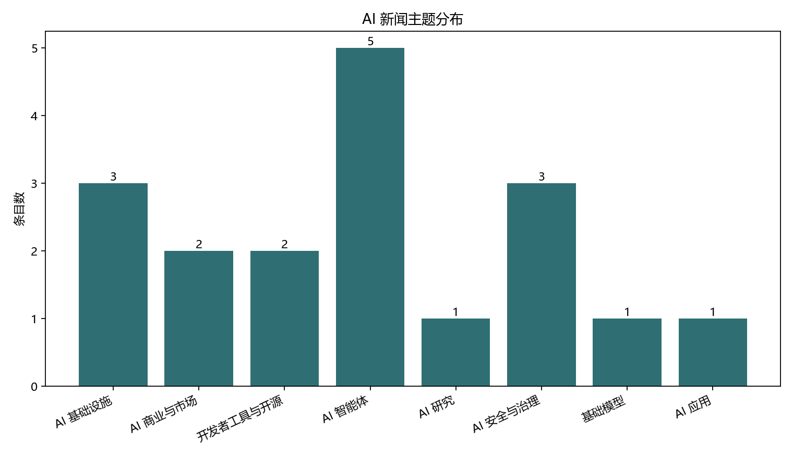
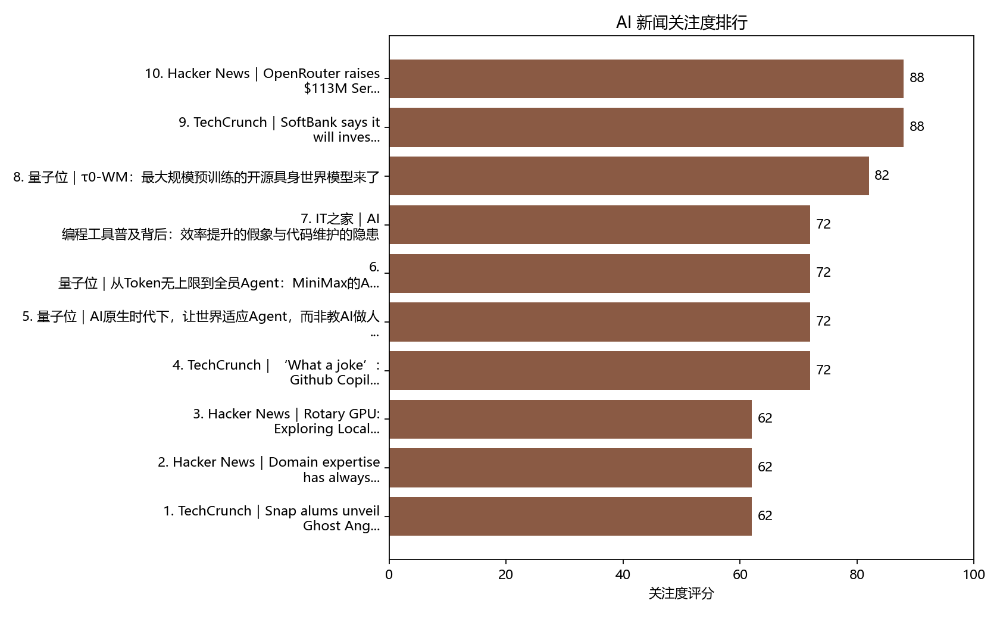

# AI 洞察日报 - 2026-05-31

报告日期：2026-05-31

## 执行摘要

本期共收录 18 条结构化新闻，主要集中在 AI Infrastructure、AI Agents 和 Foundation Models。重大产业事件包括 SoftBank 宣布在法国扩建数据中心（importance 88，opportunity high、risk medium）与 OpenRouter 完成 $113M B 轮（importance 88，opportunity high、risk low），显示算力与多模型路由基础设施进入放量扩张期。需要重点跟踪的风险为数据中心落地的环境与电网争议，以及开发者工具计费变动带来的中小用户成本压力。

## 重点事件

### 1. SoftBank says it will invest up to €75 billion to build French data centers

- 来源：TechCrunch
- 关注度：88
- 入选原因：这是涉及欧洲大规模 AI 基础设施扩张的资本与产业事件，明确提出最高 750 亿欧元投资与最多 5GW 的新增数据中心容量，短期会重塑区域算力供给格局并吸引上下游生态与资本关注。[1]
- 影响判断：机会：大规模新增算力将缓解训练与推理的地域瓶颈，推动云与边缘算力供给、数据中心产业链和企业级部署；风险：数据中心建设可能引发环境、并网与电价争议，带来监管与落地执行风险，需关注并网方案与地方审批进程。[1]

### 2. OpenRouter raises $113M Series B

- 来源：Hacker News
- 关注度：88
- 入选原因：此次由 CapitalG 等战略平台型投资者领投的 1.13 亿美元融资，结合公司自述的流量与开发者规模，表明多模型路由/网关的企业级基础设施需求已形成，具有较强产业穿透力与生态整合价值。[2]
- 影响判断：机会：融资与战略投资者的参与将加速 OpenRouter 在路由、成本优化和企业合规控制方面的产品迭代，利好多模型生产级部署與开发者生态；风险较低，但需关注其与云服务商、模型提供商的整合与企业客户落地表现。[2]

### 3. τ0-WM：最大规模预训练的开源具身世界模型来了

- 来源：量子位
- 关注度：82
- 入选原因：τ0-WM 以约 5B 参数、接近 3 万小时预训练数据（其中真机遥操作 1.78 万小时）在开源具身智能领域刷新数据规模范式，并在推理端保留显式未来想象与 Test-Time Computation，代表具身 AI 从微调走向预训练的范式变化。[3]
- 影响判断：机会：真机数据主导的预训练路径与测试时计算策略若可复现，将提升复杂长程操作任务的成功率并推动机器人部署与产业化；风险较低但仍需关注 sim2real 间隙、数据采集成本与开源可控性。[3]

## 深度分析

### OpenRouter raises $113M Series B

OpenRouter 此轮 1.13 亿美元 B 轮由 CapitalG 领投并吸引多家云与数据平台背景的投资者参与，公司的自述重点在于把自己定位为跨提供商、多模型的路由与网关层，面向生产级应用提供路由、可靠性、成本优化和合规性功能。公司报告过去六个月周均流量从 5 trillion 增至 25 trillion，且宣称今年将处理超过 a quadrillion tokens、服务 8M+ 开发者与覆盖 400+ 模型，表明其在“流量”和开发者黏性上已有明显扩展。商业逻辑上，随着多模型并行部署成为企业常态，集中或去中心化的路由层能为企业节省成本并实现质量感知的模型选取；战略投资者的构成（包括 NVIDIA、Snowflake、Databricks 等）也说明市场在寻求把路由能力嵌入现有数据与平台生态中。验证信号包括企业级合同披露、对接大型云或数据平台的技术白皮书与客户案例，以及路由层在成本和延迟上的第三方基准测试结果。[2]

- 历史脉络：在 memory 中已有关于多模型与路由基础设施的连续讨论（如 OpenRouter 的历史增长信号），此次融资与流量数据表明该主题处于放量阶段。

- 相关实体：OpenRouter, CapitalG, NVentures, NVIDIA, ServiceNow Ventures, MongoDB Ventures, Snowflake Ventures, Databricks Ventures, Andreessen Horowitz, Menlo Ventures
- 后续验证：关注在未来 2 个月内查证是否有企业级客户案例或公开合作案例披露，验证企业采用路径；监测接下来 3 个月内是否发布针对多模型路由的性能与成本基准报告，以评估其在生产环境的竞争力；关注与主要云/数据平台的技术对接与 API 集成进展，作为生态嵌入与渠道拓展的可观察信号

### τ0-WM：最大规模预训练的开源具身世界模型来了

τ0‑WM 将真机遥操作数据（约 1.78 万小时）纳入预训练主体，并在推理阶段引入 Test‑Time Computation（多组候选动作、RCS 评分与 LAR 模拟器修正）以提升长程精细操作成功率。文章列出了模型在若干未见过任务上的量化提升：裸策略 43%，加 RCS 提升到 50%，再叠加 LAR 达到 60%，并在最难的任务上有更大改善。技术上，τ0‑WM 用 Wan2.2‑5B 驱动 VAM（动作提议）并联动动作条件视频模拟器做沙盘验证，训练数据通过 modality‑specific supervision masks 把有动作标签与无动作标签的数据统一揉进同一预训练体系。若这些实验结果在第三方复现，表明具身智能的预训练范式可能从“仿真＋微调”向“大规模真机数据为主的预训练”转变，从而影响机器人产品化与数据采集商业模式。短期验证信号包括开源代码与权重的评测复现、社区复现的 benchmark 与在更多任务上的零次泛化验证数据。[3]

- 历史脉络：相较于以往多把真机数据留作微调的行业惯例，τ0‑WM 更像是数据策略的反转与扩展，属于行业范式上升温的信号。

- 相关实体：τ0‑WM, 罗剑岚, 上海创智学院, 智元机器人, Wan2.2‑5B, UMI, EgoCentric
- 后续验证：关注核查接下来 1 个月内是否有第三方在公开 benchmark 上复现 τ0‑WM 的关键任务结果（尤其是 Pen→Box 成功率的提升）；观察模型权重、训练数据说明或采集合规文件是否在 2 个月内公开，以评估社区复现路径与数据合规风险；跟踪是否有厂商或研究团队基于 τ0‑WM 的 Test‑Time Computation 在真实机器人平台的小规模部署试点，以验证工程可行性与成本模型

## 历史对照

### Memory 使用概览

- relevance 后候选：18 条
- 历史强重复过滤：0 条
- 检索到同主题历史摘要：52 条
- 读取历史全文：5 条
- 最终采纳为历史依据：2 条

### 事件对照

- **今日事件**：SoftBank says it will invest up to €75 billion to build French data centers
  **关联历史事件**：PPIO入选非凡产研「2026 Global AI 100」，以AI实力领跑出海新浪潮（2026-05-29T11:24:57+00:00）
  关系：related_context；相关强度：55/100
  为什么相关：PPIO 的全球分布式算力与节点扩展展示了近期开启区域算力部署与商业化的背景，能作为判断今日大规模数据中心投资对产业链与跨区算力布局影响的参照。
  对今日判断的影响：此历史背景表明今日事件不是孤立的资本投入，而是更广泛算力布局与商业化趋势的放大，增强了对短期内产业链回流与合作机会的判断。
- **今日事件**：OpenRouter raises $113M Series B
  **关联历史事件**：消息称微软下周发布英伟达处理器 Windows PC，戴尔也会跟进（2026-05-30T14:58:55+00:00）
  关系：background；相关强度：45/100
  为什么相关：微软与硬件/芯片厂商在本地 AI 域的动作顯示算力與本地执行能力的方向性变化，可为 OpenRouter 的多模型路由與本地/云混合部署提供市场化背景参考。
  对今日判断的影响：作为背景参照，该历史事件提示企业在选择多模型部署架构时会同时考虑本地执行与路由策略，支持把 OpenRouter 的融资视为应对跨提供商与本地/云混合复杂性的商业化响应。

## 趋势洞察

- **AI 基础设施扩张动能显著，供给侧热度上升**（范围：技术，趋势：升温，使用历史：是）
  近期多条高重要性条目集中在算力与基础设施：软银在法国拟投至多 €75B、OpenRouter 完成 $113M 筹资并宣称流量剧增、以及联想 / 本地 AI 主机等历史信号共同表明算力与多模型路由层的供给侧正在加速扩张。关键依据为大型资本投入、企业级路由产品的融资与流量指标，以及本地+云混合推理产品的市场化动作，因而判断为 升温（升温）。[1, 2]
  历史依据：PPIO入选非凡产研「2026 Global AI 100」，以AI实力领跑出海新浪潮（2026-05-29T11:24:57+00:00）：PPIO 的全球分布式算力与模型即服务案例提供了区域算力部署與商业化的近期背景，支撑对今天大规模算力投资与路由层需求上升的延续判断。

## 风险与机会

### 风险
- **数据中心建设的环境与并网风险需重点跟踪** [中] 软银拟在法国大规模扩建数据中心并提出高额投资目标，历史与本地反对声音显示数据中心项目容易触发环境、并网与电价争议，若出现审批延迟或并网受限，将直接影响交付节奏与成本。建议重点跟踪地方并网方案与环境评估进展。[1]

### 机会
- **多模型路由与跨提供商网关的企业化机会** [高] OpenRouter 的 B 轮融资与其披露的流量/开发者规模显示，企业在多模型生产部署中对路由、成本优化和合规控制的需求已成规模机会。投资方包含多个平台型机构，表明该层可作为企业与平台整合的商业切入点，利于企业级产品化與生态合作。[2]

## 图表

## 结构化新闻判断说明表

| 序号 | 标题 | 来源 | 主题 | 事件 | 关注度判断 | 风险提示 | 机会提示 | URL |
| --- | --- | --- | --- | --- | --- | --- | --- | --- |
| 1 | SoftBank says it will invest up to €75 billion to build French data centers | TechCrunch | AI Infrastructure | market | 88：这是涉及欧洲大规模AI基础设施扩张的资本和产业事件，且明确关联数据中心容量与AI价值链布局，影响范围较大。 | 中：材料同时提到数据中心建设引发的环境、电网和电价争议，说明项目存在一定监管与落地风险。 | 高：新增大规模数据中心容量有望增强AI算力供给，并为欧洲AI训练和部署需求提供基础设施支撑。 | [link](https://techcrunch.com/2026/05/30/softbank-says-it-will-invest-up-to-e75-billion-to-build-french-data-centers/) |
| 2 | OpenRouter raises $113M Series B | Hacker News | AI Infrastructure | funding | 88：本次融资由 CapitalG 等战略性平台公司领投且参与方包括 NVIDIA、Snowflake、Databricks 等，结合公司声称的流量和开发者规模，表明这是影响多模型基础设施供应的重要商业事件。 | 低：公告主要强调增长、产品能力和企业控制，并未披露安全事件、合规失败或交付问题，因此材料中未显示显著的安全或合规风险信号。 | 高：投资方多为基础设施与数据平台型公司且公司报告大幅流量和广泛开发者采用，说明对多模型路由与网关层的企业需求明确，扩展企业部署与生态集成机会显著。 | [link](https://openrouter.ai/announcements/series-b) |
| 3 | τ0-WM：最大规模预训练的开源具身世界模型来了 | 量子位 | Foundation Models | model_release | 82：τ0-WM 在开源具身智能领域以5B参数和约3万小时预训练数据（其中1.78万小时为真机遥操作）刷新规模记录，并把真机数据作为预训练主体，这可能改变具身智能的数据与预训练范式，因而具有较高关注度。 | 低：报道未提及安全、合规或滥用事件，主要讨论的是数据规模、训练方法与性能提升；尽管文中提到 sim2real 间隙与数据采集成本等不确定性，但没有显示立即的高风险信号。 | 高：将大规模真机遥操作数据并入预训练且在推理阶段保留显式未来想象（Test-Time Computation），在复杂操作任务上显著提升成功率，表明对具身智能部署、开发者研究与产业化路径存在明确的机会。 | [link](https://www.qbitai.com/2026/05/426832.html) |
| 4 | ‘What a joke’: Github Copilot’s new token-based billing spurs consternation among devs | TechCrunch | Developer Tools and Open Source | market | 72：GitHub Copilot 是重要的开发者工具，这次计费机制调整直接影响开发工作流中的成本结构和使用方式，因此具有明确的行业跟踪价值。 | 中：报道显示开发者对价格上涨和预算失控存在明显不满，但材料未表明出现安全、合规或交付层面的严重风险。 | 中：按用量计费可能为高频企业用户提供更灵活的商业模式，但材料同时显示其短期更像是成本争议而非明确的增长机会。 | [link](https://techcrunch.com/2026/05/30/what-a-joke-github-copilot-s-new-token-based-billing-spurs-consternation-among-devs/) |
| 5 | AI原生时代下，让世界适应Agent，而非教AI做人 \| 港大黄超@AIGC2026 | 量子位 | AI Agents | research | 72：该演讲结合开源项目 nanobot、CLI-Anything 与实际分布式训练实验，提供了对Agent基础设施和交互范式的具体实现与验证，可能影响开发者工具与Agent部署路径，因此具有中上级别关注度。 | 中：材料指出Agent在长程任务和大规模协作时存在鲁棒性、验证与协调开销问题，并强调token成本与企业级交付要求，表明实现生产级Agent仍有可观的不确定性和执行风险。 | 高：开源轻量Agent的高关注度、CLI-Anything 提出的Agent-native交互路径以及分布式训练实验的可行性共同表明在开发者生态、企业部署和科研加速方面存在明显的采用与商业化机会。 | [link](https://www.qbitai.com/2026/05/426819.html) |
| 6 | 从Token无上限到全员Agent：MiniMax的AI Native组织进化实践 | 量子位 | AI Agents | product_launch | 72：该演讲在观众规模大、传播广的行业峰会上公开发布，且MiniMax已在2026年1月港股上市并连续推出多款面向企业的产品，显示对产业部署和企业采用有明确影响。 | 低：材料主要为组织实践与产品分享，未披露安全、合规或滥用事件，虽提及Token消耗与内部接受度差异，但未显示已发生的重大风险。 | 高：公司报告通过模型与Agent实践能明显提升研发与生产效率（文中提到30%～50%代码由模型生成），并且推出多模态与Agent产品，表明企业级Agent和多模态商业化机会较强。 | [link](https://www.qbitai.com/2026/05/426793.html) |
| 7 | AI 编程工具普及背后：效率提升的假象与代码维护的隐患 | IT之家 | Developer Tools and Open Source | research | 72：AI 编程工具在开发者中已广泛部署，涉及开发流程和代码质量的基础性影响，且有多项研究与行业报道共同指向可观的产业后果，因此具备较高关注度。 | 中：来源提供了多项风险信号——AI 生成代码错误率较高、词元滥用导致成本激增以及预算快速耗尽，但未出现重大安全事件或监管处罚，因此评为中等风险。 | 中：尽管存在维护和成本问题，厂商仍在推广修复与集成工具并提出流程性解决方案，表明对改进开发效率和商业化存在可实现但有条件的机会。 | [link](https://www.ithome.com/0/957/744.htm) |
| 8 | Snap alums unveil Ghost Angels fund | TechCrunch | AI Business and Market | funding | 62：由多名有影响力的 Snap 校友联合发起并已进行后续投资，表明对社交类 AI 初创的早期资本支持正在形成，具有对早期创业生态的可跟踪影响。 | 低：报道未披露基金规模且未提及安全、合规或已发生的争议性事件，因此目前没有显示出明显的系统性风险信号。 | 中：基金聚焦在社交和消费领域的早期 AI 创业，且报道提到对 AI 原生格式和生成式创意工具的投资意向，说明对降低创作门槛和孵化新模式存在显著机会，但具体影响取决于后续资本部署规模。 | [link](https://techcrunch.com/2026/05/30/snap-alums-unveil-ghost-angels-fund/) |
| 9 | Domain expertise has always been the real moat | Hacker News | AI Agents | other | 62：文章指出代理式 AI 改变了工程师与域专家的分工，这一技能结构变化可能影响行业内的人才培养与岗位价值评估，因此值得关注。 | 中：材料提出工程师可能无法验证领域正确性，导致 AI 生成的“看似合理但错误”的规则通过测试并造成昂贵错误，这构成了中等的执行与准确性风险信号。 | 高：材料明确描述域专家借助代理工具能快速生成并验证结果，表明代理化工具能放大领域专长的价值，从而带来明显的采用和商业化机会。 | [link](https://www.brethorsting.com/blog/2026/05/domain-expertise-has-always-been-the-real-moat/) |
| 10 | Rotary GPU: Exploring Local Execution for Large MoE Models Under Limited VRAM | Hacker News | AI Research | research | 62：作为一篇探索性研究，论文直接演示了在消费级 GPU 上本地运行大型 MoE 模型的可行性，针对部署可及性提出具体实验结果，对模型部署与推理方法的技术讨论具有中等关注度。 | 低：文章多次强调结果为探索性并非替代数据中心，正文未披露安全、隐私或滥用相关问题，材料中未显示显著的安全或合规风险信号。 | 中：公开验证表明部分大型模型能力可在受限硬件上实现本地推理，这为受硬件、预算或封闭网络限制的组织带来潜在部署与可及性机会，但结果尚属探索性，推广路径和性能限制仍不明确。 | [link](https://arxiv.org/abs/2605.29135) |
| 11 | Battle to regulate artificial intelligence grows in DC - KCENTV.com | Google News | AI Safety and Governance | policy | 60：标题与摘要指出华盛顿关于人工智能监管的争论加剧，政策走向若有实质进展将影响行业治理，因此具备中等关注度。 | 中：材料仅为头条式报道，未提供具体监管措施或负面事件细节，但监管升级的信号提示对企业合规与经营存在可落实的中等风险。 | 中：监管讨论可能催生明确规则或合规服务需求，从而为法律合规、审计和合规工具等相关领域带来一定商业机会，但当前细节不足以判定高机会。 | [link](https://news.google.com/rss/articles/CBMi1AFBVV95cUxPWHJNamFfZ0pnX2N5T0tNQUhSc1E2ejBQbmQxcHU4TXdGVi1fS2NObG04X3hJeENMNGR0MXAyZXUtVExwbjg3WnBJNUFDQjhlMkNMaDF5X1gwazZ3T1lHS245cUlZWmx2VS02RFhmQlREbDRmbjNCQjZFS1JCMFhmOXlKUUs2WjNtZWFncGY4czAzQXc3eGJvOEFnWVFyd1ZZWVVIMmF5UThLWGVWc3ppcEVCaHBCcEZpRG5tYXdPTVBxUjhMSkc1MUdmY05uT1ZVNUFROQ?oc=5) |
| 12 | Technological Sovereignty And Strategic Competition In The Age Of Artificial Intelligence – Analysis - Eurasia Review | Google News | AI Safety and Governance | policy | 60：文章主题涉及技术主权与战略竞争，触及国家政策和国际竞争议题，对监管与战略决策具有参考价值。 | 中：标题显示讨论技术主权与战略竞争，暗含地缘政治和政策摩擦风险，但材料未报告具体的安全事件或即时政策变动，因此评估为中等风险。 | 中：关于技术主权与战略竞争的分析可能影响国家和企业的战略选择与投资方向，但原文未提供明确的商业或技术采纳信号，因此机会判断为中等。 | [link](https://news.google.com/rss/articles/CBMi1AFBVV95cUxNZ01UVWZLbTZENzQ3Ymo4UWM3bUxwNFZ0M0lQdHZxa0hmemp6ZnBSS0pmeEZGUjBfUXNwdkxWc0pFZFpiRTB4V1I1dmkyU1Y4aTRROHhKNFVqRmViSlBwZDFpbDg2RUMySm9jbWNVMTVzMlJac3lBajJaSkhUdDB6NnZqYnBQTWJoajNob2NFaC1iZUs2d09uQkg1UjEtUWxFZUZQZmRFRWthcEtHd1hGSVBmQktxclZ0NVV4ZHRHTXhDd1BLV3MxRjRTMm03Nkx2T2YzZw?oc=5) |
| 13 | Steam 页面确认：《使命召唤：现代战争 4》存在生成式 AI 制作的内容 | IT之家 | AI Applications | product_launch | 60：作为大型游戏系列的新作，Steam 页面直接披露使用生成式 AI 的事实对玩家体验和舆论有直接影响，且结合以往争议该事项对发行口碑具有可观关注度。 | 中：材料显示将使用生成式 AI 且未披露细节，结合前作因大量 AI 美术遭到玩家抵制，存在较明显的声誉和用户满意度风险。 | 中：文章提到几乎所有主流游戏工作室都在使用生成式 AI，表明此类工具在生产效率和跨平台内容制作上有潜在优势，但质量和玩家接受度仍有不确定性。 | [link](https://www.ithome.com/0/957/752.htm) |
| 14 | Show HN: Komi-learn – continuous memory and self-improvement for coding agents | Hacker News | AI Agents | product_launch | 58：该开源项目提出连续记忆与自我改进的智能体工作流，兼容主流编码模型并提供社区池机制，对开发者工具和智能体实验有明确参考价值但尚未大规模验证。 | 中：作者强调项目处于早期且未大规模实战验证，虽然声明对敏感信息有过滤和本地审批机制，但早期实现与社区共享可能带来隐私或错误学习的风险。 | 中：项目直接兼容 Claude Code 与 Codex、支持社区池与签名机制，若稳定可推动编码智能体在开发者工作流中的采用，但当前采纳和可靠性仍不确定。 | [link](https://github.com/kurikomi-labs/komi-learn) |
| 15 | 金河田预告碳化硅 (SiC) 方案 Vortexis Platinum 高功率电源 | IT之家 | AI Infrastructure | product_launch | 58：该发布涉及导入碳化硅器件并瞄准 AI/HPC 服务器与数据中心，属于面向 AI 基础设施的硬件升级，技术影响可跟踪但来自单一厂商且非行业头部事件。 | 低：报道为产品预告与规格信息，未披露安全、合规或已发生的故障与风险证据，因此不存在明显的高风险信号。 | 中：碳化硅器件和面向 AI/HPC 的服务器电源可提高能效并支持高算力平台部署，且扩展至 PC 平台显示一定的商业化与市场扩展机会，但影响范围主要限于电源与机箱硬件领域。 | [link](https://www.ithome.com/0/957/784.htm) |
| 16 | Build Agents, Not Pipelines | Hacker News | AI Agents | other | 45：该文为技术性设计指南，聚焦 agent 与 pipeline 的架构选择，对开发者设计决策有参考价值，但来源为论坛转载且互动与影响力有限，因此重要性属于中低。 | 中：文章明确指出 agent 可能导致执行时间和成本不可预测并提到 prompt injection 风险，表明存在可量化的运行与安全不确定性但未报告实际事故。 | 中：作者强调 agent 在处理更大上下文和复杂任务时更有优势，并列举多款成功的编码 agent 作为证据，表明对开发者工具与编码智能体存在明确的能力和采纳机会。 | [link](https://www.seangoedecke.com/build-agents-not-pipelines/) |
| 17 | When used in the ‘wild’ conditions of the real world, large language AI stumbles - HealthExec | Google News | AI Safety and Governance | other | 40：该条目仅为简短报道，未提供新研究、具体事故或可量化证据，影响主要限于对模型可靠性的讨论，因而关注度有限。 | 中：标题与正文都指出模型在真实部署情境下会出错，提示可靠性与部署风险存在，但材料未给出具体严重后果或系统性故障证据。 | 低：报道强调的是失误和局限性，未呈现技术改进或商业化采纳的正面信号，因此带来的直接机会有限。 | [link](https://news.google.com/rss/articles/CBMiuAFBVV95cUxQMlp2cUVCZk13RVRrbGQ5dnVNOFZIQlB1Wk5nUjNVb3dDMjZfNlhlcUp4YkoxaDhwR2tLZ2Z2NERFdHdlTGUwa1ladGpnT1VwWS1ueVQ1MVJvbTdqbUx6Z1dGenFNM2s1aUptUHNlOGFWeHFvRklHeHdmS3J3anRhVGdHT3FpdHZKRW9mRk9vcGFGTUZoOFVpV2ROQUxiSW5FUk82Q2ZPbXN6THJpek5OMExLRGV0X211?oc=5) |
| 18 | Jay Casbon: Pope Leo XIV, Artificial Intelligence and Santa Barbara’s Future - Noozhawk | Google News | AI Business and Market | other | 20：来源为本地专栏标题，文本仅有标题重复内容且缺乏具体行业或技术细节，故总体关注度较低。 | 未知：原文仅含标题与重复的摘要，没有提供安全、合规或滥用等方面的具体信息，无法判断风险程度。 | 未知：材料未提供关于技术能力、采用路径或商业化机会的具体证据，无法评估潜在机会大小。 | [link](https://news.google.com/rss/articles/CBMimgFBVV95cUxQRUVXbkhMUEZJRzd1VUY0SzhRemVHWTd4X2NET3RaLVMwMk9idUQzNUtBOXJvWTJmOEJVTlU0czhnNzVPSVl6MXpIdGduZ2hjbVY5ZldGY0pFYjNVLWFoaFVISzVvQlQ1NmxibWlZa0VsMVVyWnhQZ0JYN01qd1VaOWlVZWYtR2dNWTFMb3FwRGNQM0tQaXhEZkN3?oc=5) |

## 参考依据

[1] TechCrunch: [SoftBank says it will invest up to €75 billion to build French data centers](https://techcrunch.com/2026/05/30/softbank-says-it-will-invest-up-to-e75-billion-to-build-french-data-centers/)
[2] Hacker News: [OpenRouter raises $113M Series B](https://openrouter.ai/announcements/series-b)
[3] 量子位: [τ0-WM：最大规模预训练的开源具身世界模型来了](https://www.qbitai.com/2026/05/426832.html)
[4] TechCrunch: [‘What a joke’: Github Copilot’s new token-based billing spurs consternation among devs](https://techcrunch.com/2026/05/30/what-a-joke-github-copilot-s-new-token-based-billing-spurs-consternation-among-devs/)
[5] 量子位: [AI原生时代下，让世界适应Agent，而非教AI做人 | 港大黄超@AIGC2026](https://www.qbitai.com/2026/05/426819.html)
[6] 量子位: [从Token无上限到全员Agent：MiniMax的AI Native组织进化实践](https://www.qbitai.com/2026/05/426793.html)
[7] IT之家: [AI 编程工具普及背后：效率提升的假象与代码维护的隐患](https://www.ithome.com/0/957/744.htm)
[8] TechCrunch: [Snap alums unveil Ghost Angels fund](https://techcrunch.com/2026/05/30/snap-alums-unveil-ghost-angels-fund/)
[9] Hacker News: [Domain expertise has always been the real moat](https://www.brethorsting.com/blog/2026/05/domain-expertise-has-always-been-the-real-moat/)
[10] Hacker News: [Rotary GPU: Exploring Local Execution for Large MoE Models Under Limited VRAM](https://arxiv.org/abs/2605.29135)
[11] Google News: [Battle to regulate artificial intelligence grows in DC - KCENTV.com](https://news.google.com/rss/articles/CBMi1AFBVV95cUxPWHJNamFfZ0pnX2N5T0tNQUhSc1E2ejBQbmQxcHU4TXdGVi1fS2NObG04X3hJeENMNGR0MXAyZXUtVExwbjg3WnBJNUFDQjhlMkNMaDF5X1gwazZ3T1lHS245cUlZWmx2VS02RFhmQlREbDRmbjNCQjZFS1JCMFhmOXlKUUs2WjNtZWFncGY4czAzQXc3eGJvOEFnWVFyd1ZZWVVIMmF5UThLWGVWc3ppcEVCaHBCcEZpRG5tYXdPTVBxUjhMSkc1MUdmY05uT1ZVNUFROQ?oc=5)
[12] Google News: [Technological Sovereignty And Strategic Competition In The Age Of Artificial Intelligence – Analysis - Eurasia Review](https://news.google.com/rss/articles/CBMi1AFBVV95cUxNZ01UVWZLbTZENzQ3Ymo4UWM3bUxwNFZ0M0lQdHZxa0hmemp6ZnBSS0pmeEZGUjBfUXNwdkxWc0pFZFpiRTB4V1I1dmkyU1Y4aTRROHhKNFVqRmViSlBwZDFpbDg2RUMySm9jbWNVMTVzMlJac3lBajJaSkhUdDB6NnZqYnBQTWJoajNob2NFaC1iZUs2d09uQkg1UjEtUWxFZUZQZmRFRWthcEtHd1hGSVBmQktxclZ0NVV4ZHRHTXhDd1BLV3MxRjRTMm03Nkx2T2YzZw?oc=5)
[13] IT之家: [Steam 页面确认：《使命召唤：现代战争 4》存在生成式 AI 制作的内容](https://www.ithome.com/0/957/752.htm)
[14] Hacker News: [Show HN: Komi-learn – continuous memory and self-improvement for coding agents](https://github.com/kurikomi-labs/komi-learn)
[15] IT之家: [金河田预告碳化硅 (SiC) 方案 Vortexis Platinum 高功率电源](https://www.ithome.com/0/957/784.htm)
[16] Hacker News: [Build Agents, Not Pipelines](https://www.seangoedecke.com/build-agents-not-pipelines/)
[17] Google News: [When used in the ‘wild’ conditions of the real world, large language AI stumbles - HealthExec](https://news.google.com/rss/articles/CBMiuAFBVV95cUxQMlp2cUVCZk13RVRrbGQ5dnVNOFZIQlB1Wk5nUjNVb3dDMjZfNlhlcUp4YkoxaDhwR2tLZ2Z2NERFdHdlTGUwa1ladGpnT1VwWS1ueVQ1MVJvbTdqbUx6Z1dGenFNM2s1aUptUHNlOGFWeHFvRklHeHdmS3J3anRhVGdHT3FpdHZKRW9mRk9vcGFGTUZoOFVpV2ROQUxiSW5FUk82Q2ZPbXN6THJpek5OMExLRGV0X211?oc=5)
[18] Google News: [Jay Casbon: Pope Leo XIV, Artificial Intelligence and Santa Barbara’s Future - Noozhawk](https://news.google.com/rss/articles/CBMimgFBVV95cUxQRUVXbkhMUEZJRzd1VUY0SzhRemVHWTd4X2NET3RaLVMwMk9idUQzNUtBOXJvWTJmOEJVTlU0czhnNzVPSVl6MXpIdGduZ2hjbVY5ZldGY0pFYjNVLWFoaFVISzVvQlQ1NmxibWlZa0VsMVVyWnhQZ0JYN01qd1VaOWlVZWYtR2dNWTFMb3FwRGNQM0tQaXhEZkN3?oc=5)
